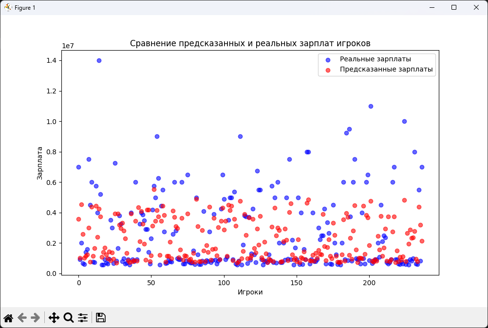
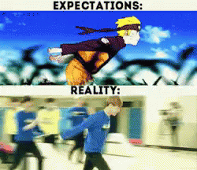

# Прогнозирование зарплат игроков НХЛ с использованием KNN

## Описание датасета
Я использовал датасет [Predict NHL Player Salaries](https://www.kaggle.com/datasets/camnugent/predict-nhl-player-salaries), содержащий данные о зарплатах 874 игроков НХЛ за сезон 2016/2017. В датасете представлено 151 предикторный признак и три файла:
- `train.csv` — данные о 612 игроках с известными зарплатами;
- `test.csv` — данные о 262 игроках без известных зарплат;
- `test_salaries.csv` — реальные зарплаты для тестовой выборки.

## Подготовка данных
Перед обучением модели проведена предобработка данных:
1. Заполнены пропущенные значения в колонке "Pr/St" модой.
2. Удалилены строки, где все значения в столбцах `DftYr`, `DftRd`, `Ovrl` отсутствовали.
3. Заполнены пропущенные значения в числовых колонках средними значениями.
4. Удалены некорректные строковые столбцы, содержащие нечисловые данные.
5. Масштабированы признаки с помощью `StandardScaler`.

## Обучение модели
Я использовал метод k-ближайших соседей (`KNeighborsRegressor`) для предсказания зарплат игроков. 
1. Обучил модель с `K=5` и рассчитал MAE и MSE.
2. Подобрал оптимальное значение `K` с помощью `GridSearchCV` (наилучшее значение оказалось `K=26`).
3. Обучил модель с найденным оптимальным значением `K` и повторно рассчитал MAE и MSE.

## Визуализация
Для наглядности добавил график сравнения предсказанных и реальных зарплат первых 100 игроков из тестовой выборки. Это помогает визуально оценить точность предсказаний модели.

## Выводы
Модель KNN показала неплохие результаты, но в некоторых случаях предсказания сильно отклоняются от реальных значений. В частности это касается топовых игроков, зарплата которых сильно переоценена. Возможные улучшения включают добавление новых признаков и использование других моделей машинного обучения.
